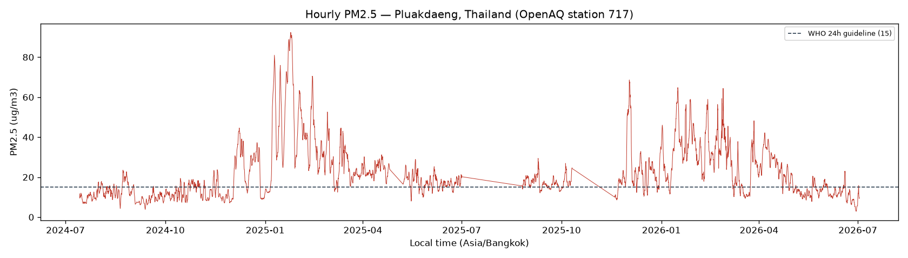
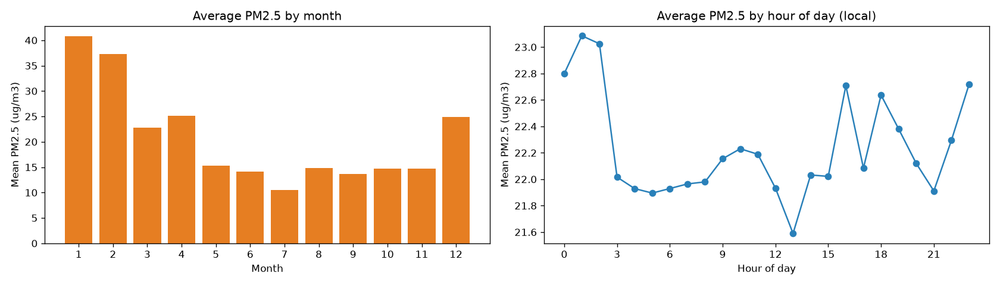

# 🌫️ IAQ Digital Twin — PM2.5 Forecast (LSTM)

Forecasting short-horizon PM2.5 air quality using an LSTM, wrapped in a simple
dashboard. Built as a portfolio piece for an IIoT / predictive Digital Twin
research direction — the pipeline is deliberately **data-source-agnostic** so
the same code can run on a live sensor feed later.

> **Status:** 🚧 Work in progress. Data ingestion is done; modelling and
> dashboard are next. See the roadmap below.

## Data source

Real hourly PM2.5 measurements pulled live from the **[OpenAQ v3 API](https://docs.openaq.org/)**
rather than a static CSV — using a real API keeps the "live IIoT data" narrative
honest and lets reviewers verify the data themselves.

- **Station:** Pluakdaeng District Health Office, Rayong, **Thailand** (OpenAQ location `717`)
- **Signal:** PM2.5, hourly aggregates (µg/m³)
- **Window pulled:** ~24 months (Jul 2024 → Jul 2026), 12,477 hourly rows
- **Why this station:** `fetch_data.py` auto-selects, among all PM2.5 stations in
  the country, the one that is still actively reporting *and* has the longest
  history — LSTMs need long, continuous series to learn seasonality.

## Exploratory data analysis

Run with `python eda.py` (regenerates both figures below and prints findings).

| Metric | Value |
|---|---|
| Rows (hourly) | 12,477 |
| Time coverage of range | 72.4% (12,477 of 17,241 hourly slots) |
| Mean / median PM2.5 | 22.2 / 18.2 µg/m³ |
| Max PM2.5 | 92.4 µg/m³ |
| Null / non-positive values | 0 / 0 |



**What the data shows:**

- **Strong yearly seasonality.** Monthly mean peaks in the dry / open-burning
  season (**January ≈ 41 µg/m³**) and bottoms out in the monsoon
  (**July ≈ 10 µg/m³**) — a ~4× swing well above the WHO 24h guideline (15).
  This is the dominant pattern the LSTM should learn.
- **Weak diurnal cycle.** Hour-of-day averages vary only ~1.5 µg/m³
  (21.6–23.1), so time-of-day carries little signal here; the model leans on
  recent-hours autocorrelation and the seasonal level instead.



⚠️ **The series is not perfectly continuous** — 783 time gaps, the largest
~55 days (visible as the straight diagonal segment around Aug–Sep 2025).
Preprocessing therefore builds training windows *within* continuous segments
only, so no input sequence straddles a large gap.

## Setup

```bash
python -m venv .venv
.venv\Scripts\activate        # Windows
pip install -r requirements.txt

# Get a free key at https://explore.openaq.org/register
cp .env.example .env          # then paste your key into .env
python fetch_data.py          # writes data/pm25_raw.csv
```

`.env` holds your `OPENAQ_API_KEY` and is git-ignored — never commit it.

## Preprocessing (`preprocess.py`)

Converts the raw series into supervised windows: **24 hours of history → next 6
hours**. Key steps and why they matter:

- **Small-gap interpolation.** The raw data is choppy — 65% of gaps are just
  1–2 missing hours (sensors occasionally skip a reading). We put the series on
  a complete hourly grid and linearly fill holes of **≤3 hours** (PM2.5 changes
  smoothly), which lifts usable training windows by ~68% (3,467 → 5,838).
  Genuine long gaps (up to ~55 days) are left as real breaks.
- **Chronological split (80/20).** No shuffling — the earliest 80% of the
  timeline trains, the latest 20% tests, so the model is never evaluated on
  data older than what it trained on.
- **Scaler fit on train only.** A `MinMaxScaler` learns its range from the
  training values alone (test values can fall slightly outside `[0, 1]`, which
  is the expected, leak-free behaviour) and is saved to `scaler.pkl`.
- **Gap-aware windowing.** Windows are built only inside continuous segments,
  so no input sequence straddles an unfilled gap.

Outputs: `X_train/X_test` `(n, 24, 1)`, `y_train/y_test` `(n, 6)`, `scaler.pkl`.
These artifacts are git-ignored (regenerate by running the pipeline).

## Roadmap

- [x] `fetch_data.py` — pull real hourly PM2.5 from OpenAQ v3
- [x] `eda.py` — trend + seasonality figures and data-quality report
- [x] `preprocess.py` — gap-aware windowing (24h lookback → 6h horizon) + scaling
- [ ] `train_model.py` — LSTM (Keras/TensorFlow)
- [ ] `evaluate.py` — LSTM vs. naive "last value" baseline (MAE, % improvement)
- [ ] `app.py` — Streamlit dashboard (history + live 6h forecast)

## Project structure

```
IAQ_LSTM/
├── fetch_data.py        # OpenAQ v3 ingestion → data/pm25_raw.csv
├── eda.py               # data-quality report + trend/seasonality charts
├── preprocess.py        # gap-aware windowing + scaling → .npy arrays
├── requirements.txt
├── .env.example         # template; copy to .env and add your key
├── data/
│   └── pm25_raw.csv
└── screenshots/
    ├── eda_pm25_trend.png
    └── eda_seasonality.png
```
